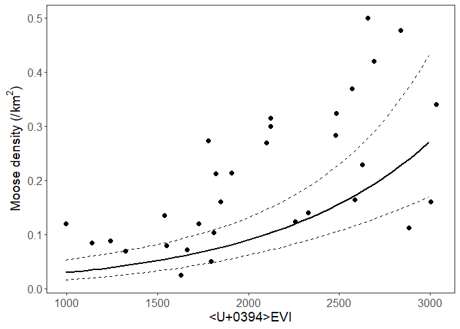
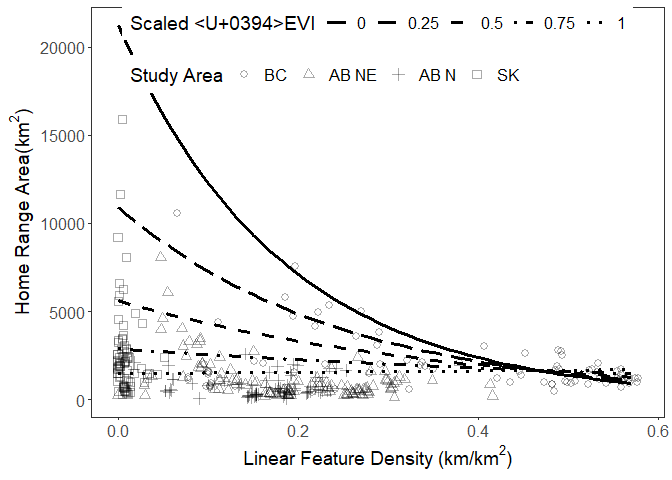

Wolf Home Range Analyses
================
Melanie Dickie
08/03/2021

In this repository you will find the data and scripts used for Dickie et
al In Prep “Resource exploitation collapses the home range of an apex
predator”.

First, we will evaluate the relationship between delta EVI, a measure of
habitat productivity, and moose density estimates in Alberta. This will
test if we can use delta EVI as a broader index of habitat productivity
from a wolf perspective.

Then we will evlaute home range size as a function of delta EVI
(i.e. habitat productivity or resource availability) and linear feature
density (a measeure of movement “cost”) to test between two hypotheses
explaining wolf home range size: diffusion hypothesis and exploitation
efficiency hypothesis.

The main landing page will walk you through the main analyses presented
within the manuscript.

Supplemental Analyses presented in the Appendix are provided in
“SupplementalAnalyses”.

Code used to create and attribute seasonal home ranges of individual
wolves are found in the folder “DataSetUpScripts”.Note that processing
large rasters, which is required to attribute the home ranges, is not
well suited to github. We therefore provide the preliminary data,
interim code, and output data which then feeds into the analyses. A
ReadMe file is provided in the subfolder to facilitate walking through
those steps

Raw data can be found in “data”

## Load and format data

``` r
#Load packages:
require(stringr)
require(dplyr)
require(tidyr)
require(broom.mixed)
require(performance)
require(lme4)
require(ggplot2)
require(tidyverse)
require(tidyr)

##Moose and productivity data:
ABWMUs2prjatt<-read.csv(here::here("data", "ABWMUs2prjatt"))

##Wolf home range data:
HRData<-read.csv(here::here("data", "All_estBuffEVILFDAttNoET.csv"))


##Set up home range data for analyses:
##Scale delta EVI data
range01 <- function(x){(x-min(x,na.rm=TRUE))/(max(x,na.rm=TRUE)-min(x,na.rm=TRUE))}
HRData$EVIScaled<-range01(HRData$EVIMean)

HRData$AnimalYear<-paste(HRData$AnimalId, HRData$Year, sep="")
HRData$PackYear<-paste(HRData$PackID, HRData$Year, sep="")
```

## Model moose density as a function of delta EVI

``` r
moosemodel<-lm(log(density_avg) ~ EVIMean + as.factor(year) + method + region, data = ABWMUs2prjatt)
moosemodeltbl<-tidy(moosemodel)
moosemodeltbl
```

## Plot predicted relationship

``` r
minEVIMoose<-min(ABWMUs2prjatt$EVIMean)
maxEVIMoose<-max(ABWMUs2prjatt$EVIMean)

moosepredex <- expand.grid(EVIMean=seq(minEVIMoose, maxEVIMoose, by=50), year = "2014", method = "distance", region = "boreal")
moosepreddensities <-  exp(predict(moosemodel,moosepredex, interval = "confidence"))
moosepredex<-cbind(moosepredex, moosepreddensities)

ggplot(data=moosepredex, aes(x=(EVIMean), y=(fit))) +
  geom_line(size=1) +
  geom_line(aes(y = lwr),colour = "black", linetype = "dashed")+
  geom_line(aes(y = upr),colour = "black", linetype = "dashed")+
  ##Plot raw data
  geom_point(data=ABWMUs2prjatt, aes(x=(EVIMean), y =density_avg), size=2)+
  theme_bw() +  
  xlab("ΔEVI") +
  ylab(expression(paste("Moose density (/ ", km^2, ")"))) +
  theme(axis.text.x = element_text(size=12), axis.title = element_text(size=14) ) + 
  theme(axis.text.y = element_text(size=12)) + 
  theme(panel.grid.minor=element_blank(), panel.grid.major=element_blank()) + 
  theme(legend.text = element_text(size = 12),legend.title = element_text(size = 14), legend.position="top", legend.box = "vertical")
```

<!-- -->

## Sample sizes of wolf home ranges

``` r
samplesize<-HRData %>% group_by(SA, Year, Season) %>% tally()
samplesize_wise <- spread(samplesize, Season, n)
samplesize_wise
```

## Use model comparison to find random effects structure

Zurr suggests to include all fixed effects and model with REML = TRUE

``` r
##Compare AnimalYear, PackYear, or AnimalYear/PackID
modpsrand1<-lmer(log(est) ~ Season + SA + DiffDTScaled + LFD*EVIScaled + (1|AnimalYear), REML=TRUE, data = HRData)
modpsrand2<-lmer(log(est) ~ Season + SA + DiffDTScaled + LFD*EVIScaled + (1|PackYear), REML=TRUE, data = HRData)
modpsrand3<-lmer(log(est) ~ Season + SA + DiffDTScaled + LFD*EVIScaled + (1|AnimalYear/PackID), REML=TRUE, data = HRData)

AIC(modpsrand1, modpsrand2, modpsrand3)
#PackYear has lowest AIC so use (1|PackYear)

##Save to table
AICTable_Rand<-as.data.frame(AIC(modpsrand1, modpsrand2, modpsrand3))
```

## Use model selection to find base model structure

Zurr suggests to use REML = FALSE

``` r
#Compare Season, Study area, or Season and Study area. Always include monitoring period (scaled)
modpsbasic1<-lmer(log(est) ~ DiffDTScaled  + Season + (1|PackYear) , REML=FALSE, data = HRData)
modpsbasic2<-lmer(log(est) ~ DiffDTScaled  + SA + (1|PackYear), REML=FALSE, data = HRData) #SA=StudyArea
modpsbasic3<-lmer(log(est) ~ DiffDTScaled  + Season + SA + (1|PackYear), REML=FALSE, data = HRData)

AIC(modpsbasic1, modpsbasic2, modpsbasic3)
#Include DiffDTScaled  + Season + SA

##Save to table
AICTable_Basic<-as.data.frame(AIC(modpsbasic1, modpsbasic2, modpsbasic3))
```

## Use model selection to evaluate resource availability and resource access

``` r
#Compare winning model above + linear feature density (LFD) vs + EVIScaled vs + LFD*EVIScaled
modpshab1<-lmer(log(est) ~ DiffDTScaled  + Season + SA + LFD + (1|PackYear), REML=FALSE, data = HRData)
modpshab2<-lmer(log(est) ~ DiffDTScaled  + Season + SA + EVIScaled + (1|PackYear), REML=FALSE, data = HRData)
modpshab3<-lmer(log(est) ~ DiffDTScaled  + Season + SA + LFD*EVIScaled + (1|PackYear), REML=FALSE, data = HRData)

AIC(modpshab1, modpshab2, modpshab3)
#LFD*EVIScaled is lowest, and all improved over null

##Save to table and combine all components to one table
AICTable_FULL<-as.data.frame(AIC(modpshab1, modpshab2, modpshab3))
AICTable_Basic$Component<-"Basic Structure"
AICTable_Rand$Component<-"Random Structure"
AICTable_FULL$Component<-"Full Structure"
AICTable<-rbind(AICTable_Rand, AICTable_Basic, AICTable_FULL)
AICTable
```

## Summarize output of the top model

``` r
modpshab3table<-tidy(modpshab3)
modpshab3table$CI<-1.96*modpshab3table$std.error##Add confidence interval
r2_nakagawa(modpshab3)##provides r2
```

    ## # R2 for Mixed Models
    ## 
    ##   Conditional R2: 0.727
    ##      Marginal R2: 0.399

## Plot modelled relationship

``` r
#For plotting purposes, use the reference categories and mean value of continuous variables

##Calculate minimums, means, and maximums for plotting
meanEVI<-mean(HRData$EVIScaled)
meanDTDiff<-mean(HRData$DiffDTScaled)
minLD<-min(HRData$LFD)
maxLD<-max(HRData$LFD)
minEVI<-min(HRData$EVIScaled)
maxEVI<-max(HRData$EVIScaled)

##Create predicted data:
modpred <- expand.grid(Season = "Snow", LFD=seq(minLD,maxLD, by =0.01), DiffDTScaled=meanDTDiff, EVIScaled=c(0,0.25,0.5,0.75,1), SA = "BC")
modpred$predArea <-  predict(modpshab3,modpred, type=c("response"),re.form=NA)

##Plot
ggplot(data=modpred, aes(x=(LFD), y=exp(predArea))) +
  geom_line(size=1.25, aes(linetype=as.factor(EVIScaled))) +
  geom_point(data=HRData, aes(x=(LFD), shape=as.factor(SA), y =(est)), size=2.5, alpha = 1/3)+
  scale_shape_discrete(name="Study Area", breaks=c("BC", "RICC", "WHEC", "SK"), labels = c("BC", "AB NE", "AB N", "SK"), solid=F)+
  scale_linetype_manual(values=c("solid","longdash", "dashed", "dotdash", "dotted"))+
  theme_bw() +  
  xlab(expression(paste("Linear Feature Density (km/", km^2, ")"))) +
  ylab(expression(paste("Home Range Area( ",km^2, ")"))) +
  theme(axis.text.x = element_text(size=12), axis.title = element_text(size=14) ) + 
  theme(axis.text.y = element_text(size=12)) + 
  theme(panel.grid.minor=element_blank(), panel.grid.major=element_blank()) + 
  theme(legend.text = element_text(size = 12),legend.title = element_text(size = 14), legend.position=c(0.5, 0.9), legend.direction = "horizontal")+
  labs(colour="Scaled ΔEVI", shape = "Study Area", linetype="Scaled ΔEVI")
```

<!-- -->

## Check model residuals

``` r
wolflist<-unique(HRData$name)
pred.areadf <- data.frame()
for(i in wolflist){
  testing <- subset(HRData, name == i)
  training <- subset(HRData, name != i)
  mymodel<-lmer(log(est) ~ DiffDTScaled + Season + as.factor(Year) + SA + LFD*EVIScaled + (1|AnimalId) + (1|PackID), REML=FALSE, data = training)
  testing$predArea <-  exp(predict(mymodel,testing, type=c("response"), re.form= ~(1|PackID), allow.new.levels = TRUE))
  testing<-as.data.frame(testing)
  pred.areadf <- rbind(pred.areadf,testing)
}

summary(lm(pred.areadf$est ~ pred.areadf$predArea))
```

    ## 
    ## Call:
    ## lm(formula = pred.areadf$est ~ pred.areadf$predArea)
    ## 
    ## Residuals:
    ##     Min      1Q  Median      3Q     Max 
    ## -3351.6  -478.0  -163.7   148.3 12259.4 
    ## 
    ## Coefficients:
    ##                       Estimate Std. Error t value Pr(>|t|)    
    ## (Intercept)           68.72053  112.52405   0.611    0.542    
    ## pred.areadf$predArea   1.12187    0.06735  16.656   <2e-16 ***
    ## ---
    ## Signif. codes:  0 '***' 0.001 '**' 0.01 '*' 0.05 '.' 0.1 ' ' 1
    ## 
    ## Residual standard error: 1309 on 357 degrees of freedom
    ## Multiple R-squared:  0.4373, Adjusted R-squared:  0.4357 
    ## F-statistic: 277.4 on 1 and 357 DF,  p-value: < 2.2e-16
